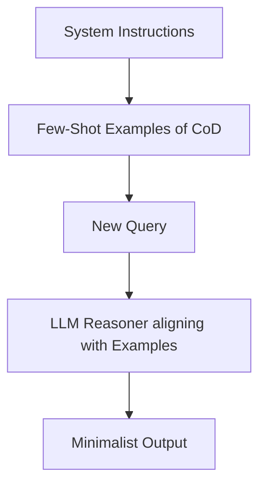

# Few-Shot Guided CoD

Few-Shot Guided CoD is an in-context learning optimization that feeds the model structured pairs of problems alongside highly compressed reasoning examples.

## How It Works
Zero-shot models sometimes struggle to follow strict brevity constraints without losing reasoning accuracy. By providing a few examples of how to draft thoughts concisely (e.g., 5-word draft reasoning steps), the model learns the expected format and maintains logic structure.

## Diagram

## Benefits
- Drastically improves constraint compliance.
- Increases reasoning accuracy on complex tasks.
- Requires no model fine-tuning.
