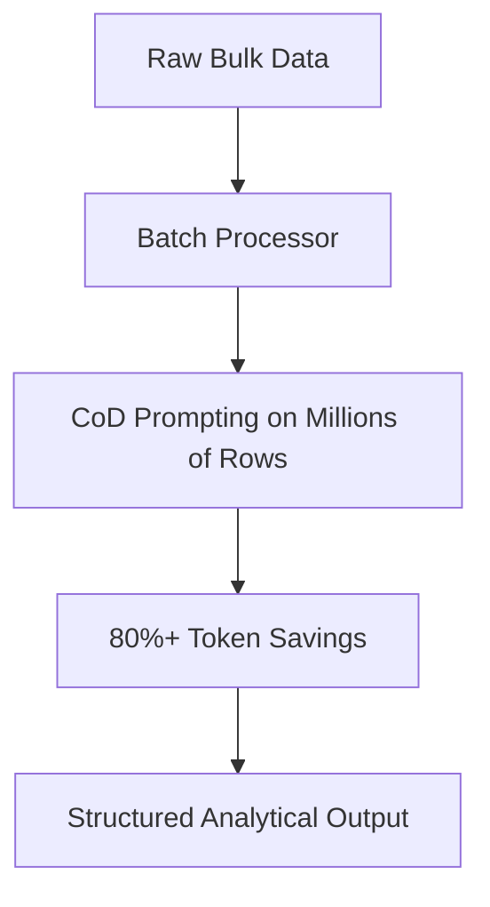

# High-Volume Analytical Batch Pipelines

Leveraging CoD for high-throughput backend data analytical tasks.

## How It Works
Analytical batch pipelines process millions of data rows (e.g., transaction audits, log files). By applying CoD constraints to each row, API costs are slashed by over 80% while retaining the quality of analytical reasoning.

## Diagram

## Benefits
- Drastically reduces operating and API subscription costs.
- Scales throughput for large batch workloads.
- Maintains high data labeling/auditing accuracy.
