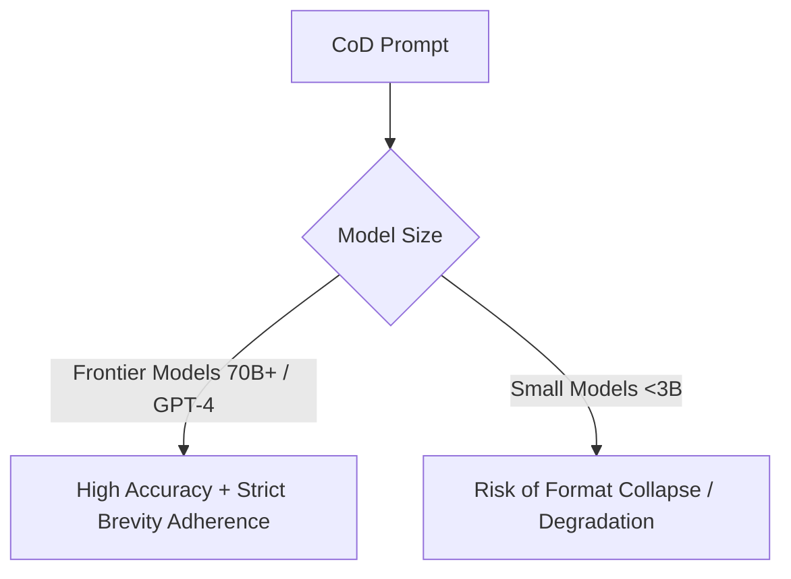

# Model Size Dependencies

Evaluating how model scale affects the effectiveness of Chain-of-Draft prompting.

## How It Works
CoD relies on the model's ability to conceptualize complex steps into tiny, dense tokens.
- **Frontier models (70B+, GPT-4o, Claude 3.5):** Highly capable of strict brevity constraints without reasoning degradation.
- **Small models (<3B):** May experience format collapse or accuracy degradation due to weaker semantic compression capabilities.

## Diagram

## Considerations
- Pre-training quality matters more than raw parameter size.
- Fine-tuned small models specifically trained on brief reasoning can overcome this limitation.
