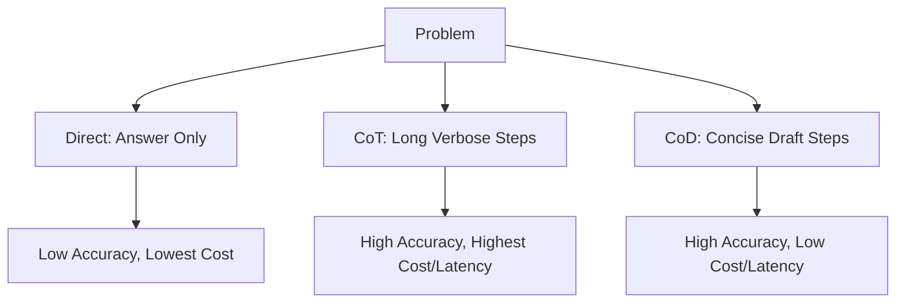

# Prompting Paradigm Comparison

An overview comparing the core prompting paradigms: Direct Prompting, Chain-of-Thought (CoT), and Chain-of-Draft (CoD).

## How It Works
- **Direct Prompting:** Direct mappings from input to output. Fast but struggles with complex math/logic tasks.
- **Chain-of-Thought (CoT):** Step-by-step reasoning with verbose explanations. High accuracy but high cost and latency.
- **Chain-of-Draft (CoD):** Step-by-step reasoning with highly compressed, draft-style notes. High accuracy (matching/beating CoT) with low cost and latency.

## Diagram

## Paradigm Comparison Summary
Refer to the comparison table in the main README for detailed benchmarks on accuracy, token cost, latency, and output style.
