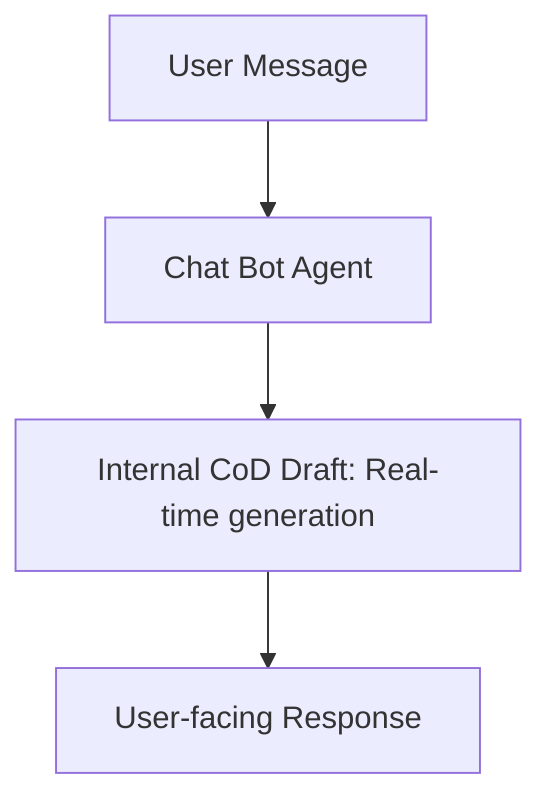

# Real-Time Conversational Agents & Chatbots

Applying Chain-of-Draft in user-facing systems where latency and response speed directly influence user satisfaction.

## How It Works
Customer service systems and bots leverage CoD to ensure low-latency response times. By preventing the model from outputting hundreds of hidden "thinking" tokens, it improves Time-To-First-Token (TTFT) and total generation time.

## Diagram

## Benefits
- Improves user experience by reducing waiting time.
- Decreases computational cost per conversation.
- Helps fit reasoning within strict real-time SLA thresholds.
