# Resource-Constrained Edge Deployments

Applying CoD on local edge devices where processing power, RAM, and bandwidth are constrained.

## How It Works
Smaller models (e.g., under 3 billion parameters) deployed locally on mobile or IoT devices use CoD to stay within hardware limits. By reducing the number of tokens to generate, CoD helps mitigate memory bandwidth bottlenecks.

## Diagram

```mermaid
graph TD
    A[On-Device Query] --> B[Edge LLM / Mobile Device]
    B --> C[CoD: Tiny context window / draft generation]
    C --> D[Low-latency Action]
```

## Benefits
- Saves battery life and reduces device thermal output.
- Lowers RAM footprint during generation.
- Keeps edge applications fast and responsive offline.
