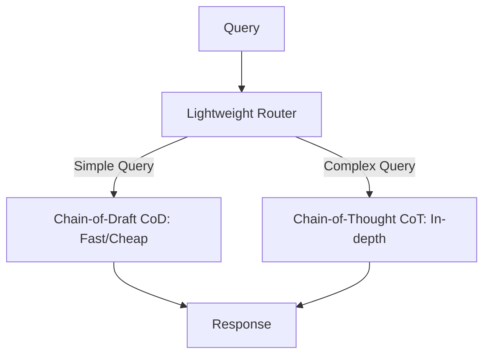

# Router-Assisted CoD (Hybrid CoT/CoD)

Router-Assisted CoD is a dynamic inference scaling architecture that combines standard verbose Chain-of-Thought (CoT) with efficient Chain-of-Draft (CoD).

## How It Works
A lightweight supervisor model acts as a traffic router. It analyzes incoming queries to determine complexity:
1. Straightforward math or retrieval queries are routed to CoD for speed and low cost.
2. Abstract, highly complex logic gates are routed to standard, verbose CoT.

## Diagram

## Benefits
- Dynamically balances cost and performance.
- Ensures complex problems receive full reasoning depth.
- Saves up to 80% tokens on average mixture workloads.
