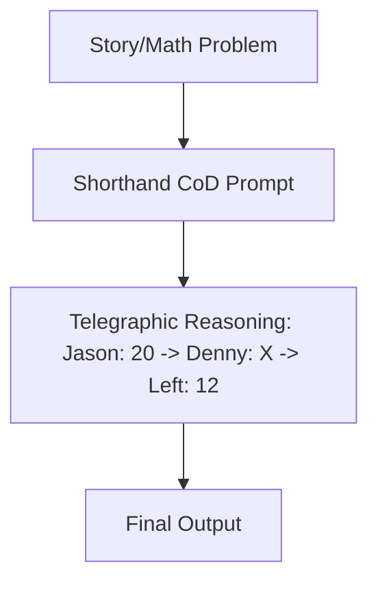

# Shorthand / Tele-Text CoD

Shorthand or Tele-Text CoD instructs the model to express its logic steps through highly truncated keywords or telegraphic phrases.

## How It Works
Instead of using full natural language sentences or pure equations, this variant allows limited text but in a compressed form (e.g., "Jason: 20 -> Denny: X -> Left: 12"). This captures semantic relationships while keeping token volume extremely low.

## Diagram

## Benefits
- Captures semantic context better than pure symbolic CoD.
- Retains high human readability for debugging.
- Minimal character and token overhead.
