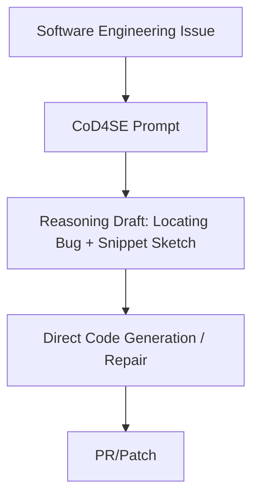

# Software Engineering CoD (CoD4SE)

Software Engineering CoD (CoD4SE) is an expansion of the CoD paradigm tailored specifically for complex coding and software engineering tasks.

## How It Works
Instead of writing long paragraphs of code architecture or explanations, the model is instructed to draft quick pseudocode blocks or localized bug coordinates (like file names and line ranges) before editing code files, shaving off significant processing time.

## Diagram

## Benefits
- Saves up to 45% of token processing time on benchmarks like SWE-bench.
- Restricts the model to producing highly focused, bug-fixing changes.
- Maintains high code quality (correctness and maintainability).
