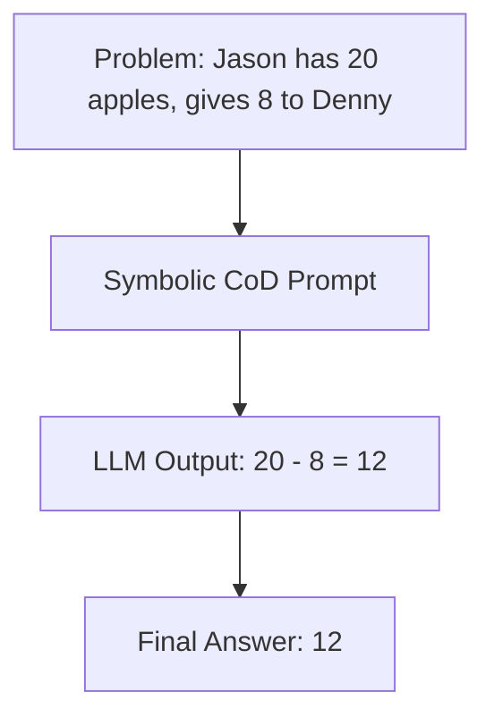

# Symbolic/Equation-Only CoD

Symbolic/Equation-Only CoD restricts the intermediate reasoning steps of the LLM entirely to mathematical or symbolic representations.

## How It Works
By bypassing natural language explanations entirely, the model is directed to output only numbers, operators, or variables (e.g., `5 * 2 = 10` $\rightarrow$ `10 + 3 = 13`) before outputting the final answer. This minimizes token counts dramatically.

## Diagram

## Benefits
- Perfect for mathematical or symbolic logic tasks.
- Eliminates semantic ambiguity.
- Extremely high token compression.
