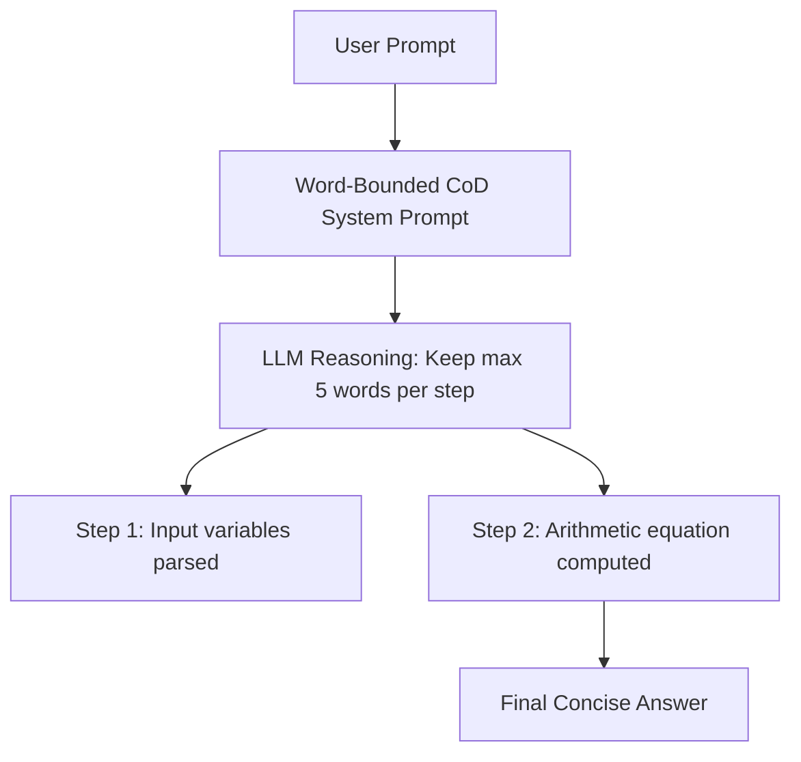

# Word-Bounded CoD (The Baseline Variant)

Word-Bounded CoD is the foundational implementation of the Chain-of-Draft prompting style. It focuses on limiting the word count of each intermediate step in the reasoning path.

## How It Works
Instead of allowing the LLM to output verbose sentences, the system prompt explicitly restricts the token/word budget per reasoning step (e.g., "maximum of 5 words per step"). This forces the model to ignore conversational fluff and output only core logical links.

## Diagram

## Benefits
- Simple to implement via system instruction updates.
- Strips conversational fillers instantly.
- Drastic reduction in generation costs.
